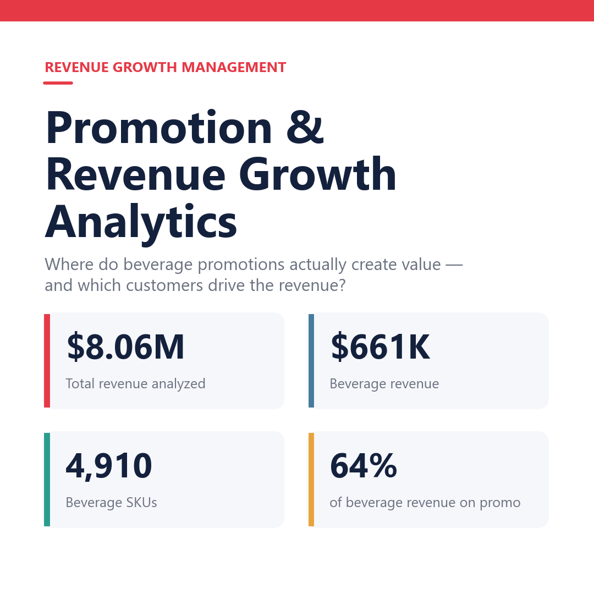
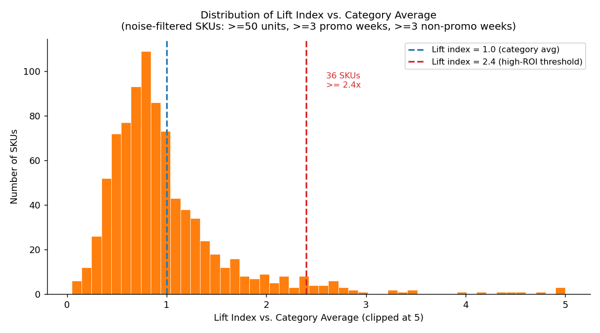
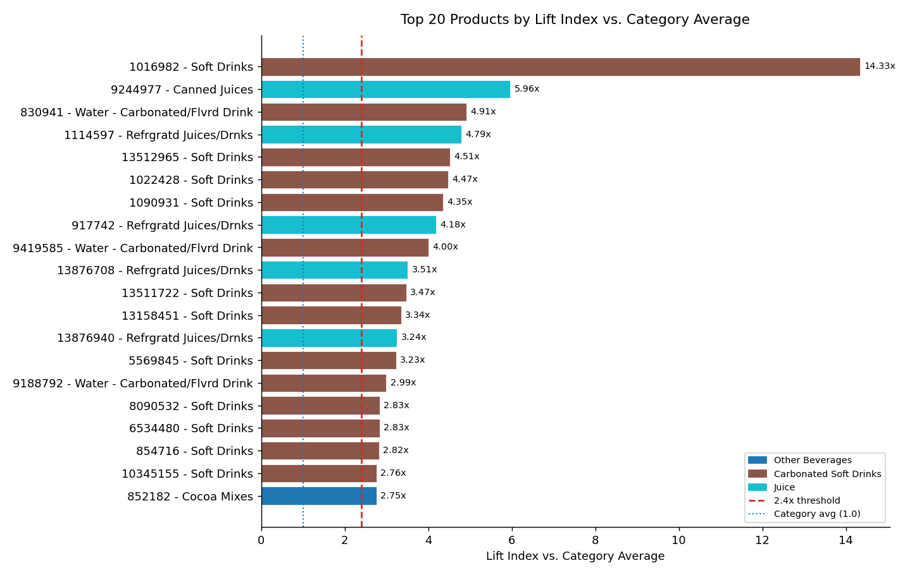
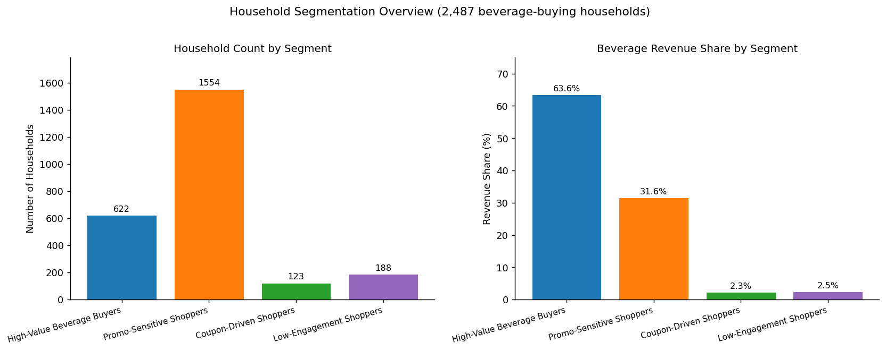
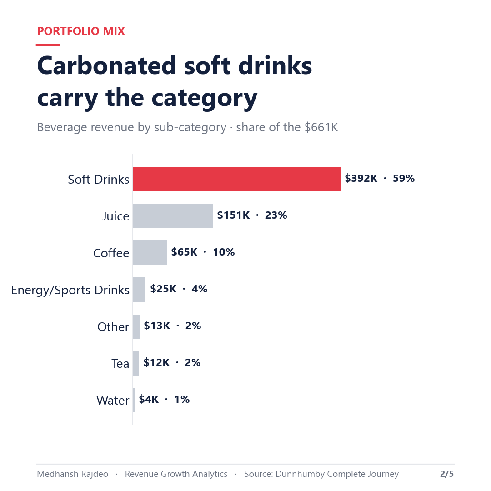
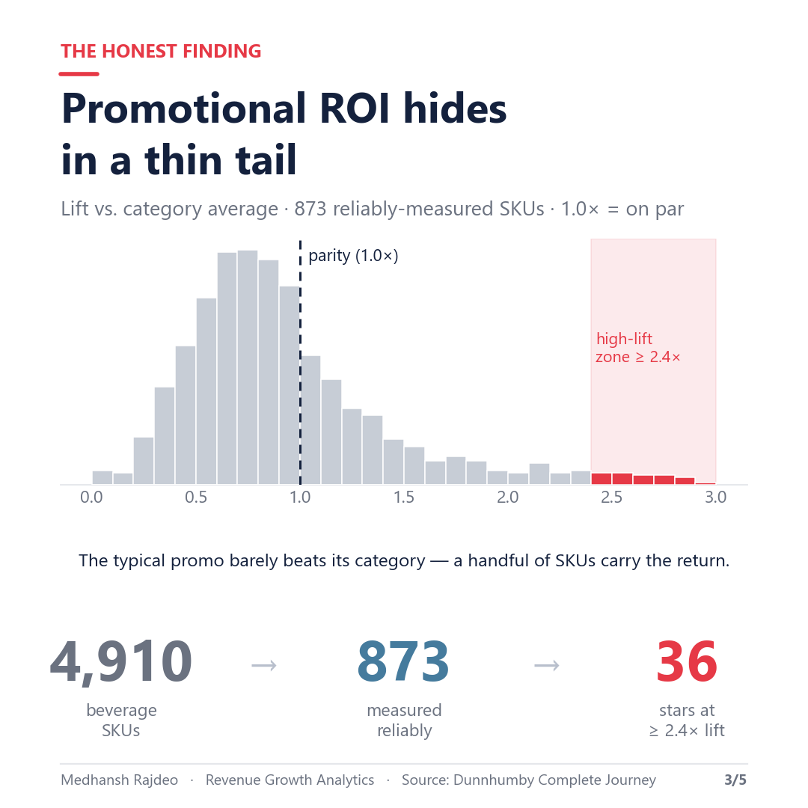
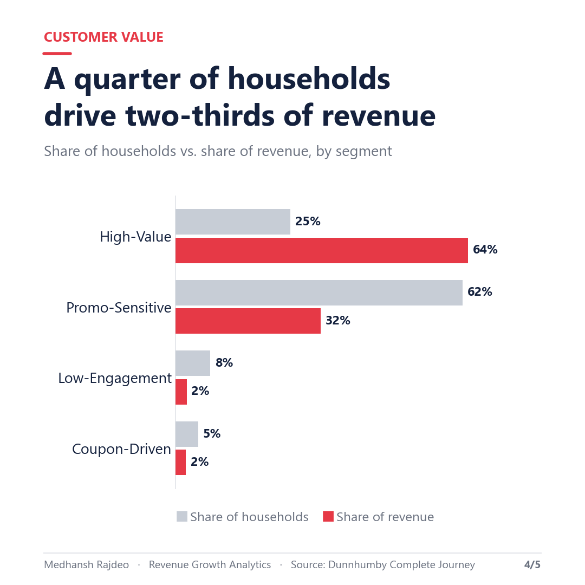
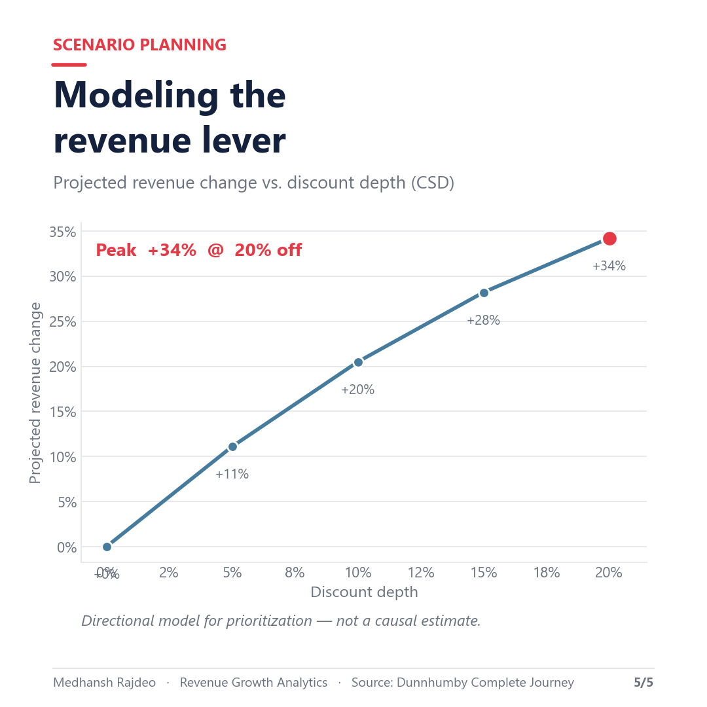

# Promotion & Revenue Growth Analytics Platform

> **Where do beverage promotions actually create value — and which customers drive the revenue?**
> An end-to-end Revenue Growth Management (RGM) analysis on ~2.6M transactions from the
> Dunnhumby *Complete Journey* dataset: promotion-lift modeling, household segmentation,
> commercial KPIs, and what-if scenario planning — built in reproducible Python.


<p align="center">
  
</p>

### TL;DR — Key Insights

- **Promotional ROI hides in a thin tail.** Of 4,910 beverage SKUs, only 873 have enough
  evidence to measure reliably — and just **36** deliver ≥2.4× their category-average lift.
  The typical promotion barely beats baseline; spend should concentrate on the stars.
- **A quarter of households drive two-thirds of revenue.** High-Value buyers are 25% of
  beverage households but **64%** of beverage revenue; Promo-Sensitive shoppers are 62.5%
  of households yet only 32% of revenue.
- **Carbonated soft drinks carry the category** — 59% of beverage revenue across 7 categories.
- **Coupons are a minor lever** (1.86% redemption) relative to shelf discounts (63.6% of
  beverage revenue is promoted).

---

## Business Problem

Revenue Growth Management (RGM) in consumer packaged goods is the discipline of
determining where, when, and how much to invest in promotions to maximize net
revenue — not just top-line sales.  For a beverage manufacturer such as Coca-Cola,
the core challenge is that the promotional budget is finite: every dollar spent on
a shelf discount or display mailer for a low-ROI SKU is a dollar not spent on a
product that would have responded with a meaningful velocity increase.

Evaluating promotional ROI requires separating signal from noise at the SKU level.
Most promoted products do not actually accelerate unit velocity during the promotion
window — the discount transfers revenue to a different accounting period without
growing the category.  Identifying the minority of products where promotion
genuinely adds velocity (the high-lift tail) is the central question this project
addresses.

Alongside SKU-level promotion analysis, household-level segmentation answers the
demand-side question: who responds to promotions, and are they high-value households
who would have purchased anyway (margin destruction) or genuinely elastic shoppers
who incrementally trade up?  Combining supply-side lift with demand-side segment
behavior creates a commercially defensible picture of where the next promotional
dollar should go.

## Dataset

Dunnhumby Complete Journey dataset — approximately 2.6 million transactions across
2,500 households at a US grocery retailer over approximately 102 weeks (~2 years).
Includes product hierarchy, household demographics (partial), campaign and coupon
distribution and redemption, and weekly causal (display/mailer) data.
Source: Dunnhumby Source Files (https://www.dunnhumby.com/source-files/).

### Data Access

The raw Dunnhumby files are **not committed** to this repository — they are
licensed for non-commercial use and are too large to host here. To reproduce the
pipeline end to end:

1. Download the **Complete Journey** dataset from the
   [Dunnhumby Source Files page](https://www.dunnhumby.com/source-files/)
   (also mirrored on [Kaggle](https://www.kaggle.com/datasets/frtgnn/dunnhumby-the-complete-journey)).
2. Unzip the CSVs into `data/raw/`.
3. Run the pipeline (see [How to Run](#how-to-run)).

What **is** committed so the project is reviewable without the raw data:

- All source code (`src/`), notebooks (`notebooks/`), and the visuals script (`scripts/`)
- The aggregated, analysis-ready exports in `data/powerbi_exports/`
  (KPIs, segments, promotion performance, dimensions) — the large transaction-level
  fact table is regenerable and excluded
- Every output chart and the LinkedIn carousel in `outputs/`

The cleaned `data/processed/` parquets are regenerable from `data/raw/` via the
pipeline and are also excluded from version control.

## Project Structure

```
rgm-project/
├── data/
│   ├── raw/                        # Original Dunnhumby CSVs (not committed — see Data Access)
│   ├── processed/                  # Cleaned parquets (not committed — regenerable)
│   └── powerbi_exports/            # Analysis-ready CSVs (fact table excluded)
├── notebooks/
│   ├── 01_data_cleaning.ipynb
│   ├── 02_beverage_filtering.ipynb
│   ├── 03_promotion_analysis.ipynb
│   ├── 04_household_segmentation.ipynb
│   └── 05_kpi_export.ipynb
├── outputs/
│   ├── charts/                     # Analysis charts (PNG)
│   ├── linkedin/                   # Presentation-ready carousel slides (1080x1080)
│   └── summary_tables/             # Intermediate CSV tables
├── scripts/
│   └── make_linkedin_visuals.py    # Generates the outputs/linkedin/ carousel
├── src/
│   ├── __init__.py
│   ├── data_cleaning.py
│   ├── beverage_filtering.py
│   ├── promotion_metrics.py
│   ├── segmentation.py
│   └── kpi_builder.py
├── requirements.txt
└── README.md
```

## Methodology

### Beverage Identification

An allowlist of `commodity_desc` strings was applied to the full 47K+ product
catalog to identify non-alcoholic packaged beverages.  Dairy milk was excluded
because it is a nutrition staple with different pricing dynamics and distinct
RGM levers.  Alcoholic beverages were excluded due to separate regulatory
and pricing structures.  The resulting scope is 4,910 SKUs assigned to seven
beverage categories:

| Category | SKUs |
|---|---|
| Carbonated Soft Drinks | 2,139 |
| Juice | 1,158 |
| Coffee | 604 |
| Tea | 394 |
| Other Beverages | 301 |
| Energy/Sports Drinks | 240 |
| Water | 74 |

### Promotion Lift Definition

Two independent signals are combined as `is_promo = signal_a OR signal_b`.

**Signal A (causal):** derived from `causal_data.csv` — a (product, store, week)
combination is flagged as promotional if `display != 0` OR `mailer != '0'`.
This is left-joined to transaction lines on `(product_id, store_id, week_no)`.
Signal A covers approximately 6.5% of beverage (product, store, week) combinations;
the discount signal carries the majority of the work.

**Signal B (discount):** a transaction line carries `retail_disc < 0` OR
`coupon_disc < 0` OR `coupon_match_disc < 0`.

**Lift formula:**

```
promotion_lift = (promo_units / promo_weeks) / (non_promo_units / non_promo_weeks)
```

This is a velocity-based measure that avoids bias from how long a product was
on-shelf.  Products with more promo weeks simply have more observation, but the
rate metric normalizes for that.

**Lift index vs. category:** each product's `promotion_lift` divided by the
unweighted mean lift of all products in its beverage_category.  A lift index of
1.0 means the product lifts exactly at the category average; values above 1.0
indicate above-average lift.

**Noise filter:** only products with >= 50 total units sold, >= 3 promo weeks,
and >= 3 non-promo weeks are included in rankings.  This removes low-observation
products where a single week of unusual volume would dominate the ratio.

### Household Segmentation

Rule-based segmentation on RFM + promotional behavior features, computed on
beverage activity only.  Priority hierarchy prevents double-counting:

1. **High-Value Beverage Buyers** — `beverage_spend >= Q3` (top 25% of spend).
2. **Coupon-Driven Shoppers** — not high-value; `coupon_usage_rate >= 10%`.
   Coupons are rare (1.86% population redemption rate), so any household using
   coupons in >= 10% of beverage baskets is a statistically strong signal.
3. **Promo-Sensitive Shoppers** — not high-value or coupon-driven;
   `promo_purchase_share >= 40%` (40% or more of beverage revenue comes from
   discounted lines).
4. **Low-Engagement Shoppers** — all remaining households.

Priority order: high spend is the most actionable RGM signal and beats behavior
tags.  Coupon use ranks second because it is a rarer, more deliberate behavior
than general discount response.

### What-If Scenarios

70 directional scenarios: 7 beverage categories x 5 discount levels (0%, 5%,
10%, 15%, 20%) x 2 coupon states (applied / not applied).

The elasticity proxy is the observed promo/non-promo unit velocity ratio from the
promotion performance table.  Projected units at a given discount level are
estimated by applying a proportional lift relative to the observed mean promo lift
for that category.  A small additional bump is applied for coupon-applied scenarios,
reflecting the observed incremental behavior of coupon users.

**All rows in `what_if_scenarios.csv` carry the label: "Directional scenario only
— not causal."**  Real causal elasticity requires a controlled experiment with
randomized promotional assignment.  The observational lift ratio is a directional
proxy subject to selection bias (promoted products are often pre-selected to be
high-selling items).

## Key Findings

### Promotion Performance

- 4,910 beverage SKUs analyzed across 7 categories
- 873 SKUs passed the noise filter (>= 50 units, >= 3 promo weeks, >= 3 non-promo weeks)
- **36 SKUs deliver >= 2.4x category-average lift**; 61 deliver >= 2.0x
- Top performer: product 1016982 in Carbonated Soft Drinks — **14.3x category-average lift**
- Median promotion lift **across all measured beverage SKUs is 0.948x** — the typical
  promotion does not meaningfully accelerate velocity. The unit-weighted mean (1.94x) is
  dragged up by a long tail of high performers. (Note: 0.948x is the full-catalog median;
  among the 873 noise-filtered SKUs, lift concentrates higher, which is where the 36 stars
  emerge.) **This is the central RGM insight: promotional ROI is concentrated in a small
  number of high-ROI SKUs. Treating all SKUs equally destroys margin.**
- Promo revenue shares by category: Water 76.4%, Carbonated Soft Drinks 68.0%,
  Energy/Sports Drinks 67.7%, Juice 60.2%, Coffee 49.4%, Other Beverages 47.1%, Tea 46.0%.





### Household Behavior

- 2,487 households purchased beverages (99.5% of all 2,500 panel households)
- **62.0% of beverage transaction lines** carry a promotional flag; promo revenue share is **63.6%**
- Coupon redemption rate: **1.86%** (2,318 of 124,548 distributed) — coupons are a minor lever
  relative to shelf discounts

| Segment | Households | % of HHs | % of Bev Revenue | Avg Spend |
|---|---|---|---|---|
| High-Value Beverage Buyers | 622 | 25.0% | 63.6% | $676.51 |
| Promo-Sensitive Shoppers | 1,554 | 62.5% | 31.6% | $134.55 |
| Coupon-Driven Shoppers | 123 | 4.9% | 2.3% | $123.11 |
| Low-Engagement Shoppers | 188 | 7.6% | 2.5% | $86.75 |



### Commercial KPIs

Full KPI table is at `data/powerbi_exports/commercial_kpis.csv` (17 rows).  KPI list:

| KPI | Value | Unit | Category |
|---|---|---|---|
| Total Revenue (All Categories) | $8,057,463 | USD | Revenue |
| Beverage Revenue | $661,333 | USD | Revenue |
| Beverage Units Sold | 310,294 | units | Revenue |
| Beverage Avg Selling Price | $2.25 | USD/unit | Revenue |
| Carbonated Soft Drinks Revenue Share | 59.2% | % | Mix |
| Beverage Promo Revenue % | 63.6% | % | Promo |
| Beverage Non-Promo Revenue % | 36.4% | % | Promo |
| Mean Promotion Lift (Unit-Weighted) | 1.94x | ratio | Promo |
| Median Promotion Lift | 0.948x | ratio | Promo |
| Coupon Redemption Rate | 1.86% | % | Promo |
| Beverage Repeat Purchase Rate | 98.9% | % | Customer |
| Avg Basket Value (All Categories) | $29.14 | USD | Customer |
| Avg Beverage Basket Value | $5.71 | USD | Customer |
| Revenue per Beverage Household | $265.92 | USD | Customer |
| Units per Beverage Household | 124.8 | units | Customer |
| High-Value Customer Share | 25.0% | % | Customer |
| Promo-Sensitive Customer Share | 62.5% | % | Customer |

## Power BI Dashboard

Dashboard CSVs live in `data/powerbi_exports/`.  Suggested 4-page layout:

### Page 1: Executive Summary

- Card visuals: Total revenue ($8.06M), Beverage revenue ($661K), Promo revenue %
  (63.6%), Total households (2,500), Repeat purchase rate
- Top 10 products by revenue (bar chart)
- Beverage revenue by category (donut chart)
- Slicers: beverage_category, week_no range

### Page 2: Promotion Performance

- Scatter: x = total_units, y = lift_index_vs_category, color = beverage_category;
  reference line at lift_index = 2.4
- Bar: top 20 products by lift_index_vs_category
- Card: count of SKUs >= 2.4x lift (36)
- Decomposition tree: promo_revenue split by category, then top products

### Page 3: Household Segmentation

- Donut: segment count distribution
- Bar: beverage revenue share by segment
- Matrix: segment x beverage_category showing revenue
- Card visuals: avg basket value ($29.14), beverage basket penetration

### Page 4: What-If Simulator

- Slicers: discount_pct (5/10/15/20%), coupon_applied (Y/N), beverage_category
- Cards: projected revenue, revenue_delta_pct
- Bar: category-level projected vs. baseline revenue
- Caveat banner: "Directional scenario — not a causal estimate"

### Suggested DAX Measures

```
Total Revenue = SUM(fact_transactions_beverage[sales_value])
Promo Revenue % = DIVIDE(CALCULATE([Total Revenue], fact_transactions_beverage[is_promo]=TRUE), [Total Revenue])
Repeat Purchase Rate = AVERAGE(dim_households[repeat_purchase_rate])
Lift Index Avg = AVERAGE(promotion_performance[lift_index_vs_category])
```

## Limitations

- Demographics cover only 32% of households (801 of 2,500).  Segment characterization
  by demographics is partial; behavioral segments are robust, but demographic profiling
  of segments cannot be generalized to the full panel.
- The `brand` column in the source data is a National/Private label flag, not a brand
  name.  Brand-level analysis is not possible without external product enrichment.
- The repeat purchase rate is high (panel households are loyal grocery shoppers by
  selection bias).  It reflects panel design, not a true acquisition funnel.
- What-if scenarios use an observational elasticity proxy.  Real price elasticity
  requires a controlled experiment with randomized promotional assignment.
- `causal_data` display/mailer flags cover approximately 6.5% of beverage
  (product, store, week) combinations; the discount-field signal (Signal B) carries
  the majority of the promo classification work.
- The dataset originates from a single US grocery chain, approximately 2017.
  Generalization to other CPG channels (convenience, foodservice, e-commerce)
  requires care.

## Presentation Deck


| | |
|:-:|:-:|
|  |  |
|  |  |


## How to Run

```bash
pip install -r requirements.txt

# 1. Download the Dunnhumby Complete Journey dataset (see Data Access above)
#    and unzip the CSVs into data/raw/

# 2. Run the pipeline (each step writes parquets to data/processed/
#    and CSVs to data/powerbi_exports/)
python -m src.data_cleaning
python -m src.beverage_filtering
python -m src.promotion_metrics
python -m src.segmentation
python -m src.kpi_builder

# 3. (Optional) regenerate the presentation visuals
python scripts/make_linkedin_visuals.py
```

Then open the notebooks in `notebooks/` for the analysis narrative, and import
`data/powerbi_exports/*.csv` into Power BI Desktop.

## License

The **code** in this repository is released under the [MIT License](LICENSE).

The **data** is the Dunnhumby *Complete Journey* dataset, provided by Dunnhumby for
non-commercial use and **not** redistributed here — see [Data Access](#data-access) for
how to obtain it from the original source.

## Author

**Medhansh Rajdeo** — analytics & data science.
This project demonstrates an end-to-end Revenue Growth Management workflow: raw data
to cleaned models to commercial insight to communication-ready visuals.
